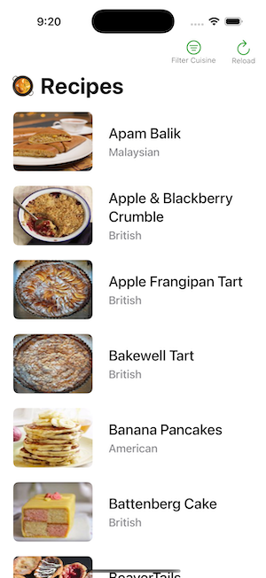
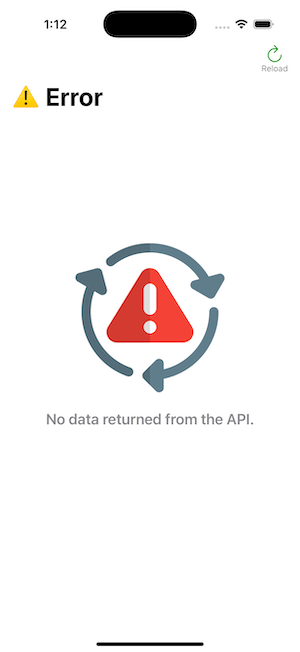

## Fetch Home Project

### Summary: Include screen shots or a video of your app highlighting its features

## Screenshot
 

## GIF

### Focus Areas: What specific areas of the project did you prioritize? Why did you choose to focus on these areas?
- Concurrency 
- Recipe List Screen
- Writing clean, readable, organized code

I prioritized these areas because the requirement specifies concurrency, implying the importance of the ask. Additionally, I wanted to ensure that the API call did not cause the application to malfunction. The “List Screen” is the core functionality of the application, and I felt it crucial to execute this part effectively. Ultimately, some individuals will review the code to assess my suitability for the role. I want them to comprehend the approaches through mere code reading, so readability is essential for that purpose. Furthermore, code organization facilitates modifications made by others after my departure, or when I am unavailable. Therefore, I believe it is important to streamline this process.

### Time Spent: Approximately how long did you spend working on this project? How did you allocate your time?

I dedicated approximately a little over six hours to this project, allocating my time effectively to organization, testing, and fulfilling all project requirements.

### Trade-offs and Decisions: Did you make any significant trade-offs in your approach?

In my approach, I prioritized clarity, maintainability, and tried to stay aligned with best practices like MVVM and dependency injection.  One trade-off was the speed of implementation vs flexibility. For example, I used protocol-based abstraction for services and data layers, which adds a bit of boilerplate upfront but makes the system easier to test and extend later. Another trade-off was using simplicity over performance, in-memory caching instead of more complex persistence. The codebase is more lean but might require reevaluation for production-scale usage. Overall, I aimed to balance code quality and delivery efficiency while leaving room for future scalability.

### Weakest Part of the Project: What do you think is the weakest part of your project?

The weakest part of the project in my opinion is the limited error handling and edge-case coverage. To stay within a time frame, I focused more on getting the core functionality working cleanly and demonstrating decisions. As a result, some areas like detailed network failure handling for error/empty states are underdeveloped. If I had more time, I'd add thought to improving resiliency and polish the UX in those failure scenarios to better simulate a production-ready app.

### Additional Information: Is there anything else we should know? Feel free to share any insights or constraints you encountered.

I wanted to add an extra feature that wasn’t included in the requirements. I decided to implement a filter that would allow users to select cuisines from a list. I began by creating a path using the Query keyword provided by SwiftData. However, I ultimately ended up using the filter array option, which turned out to be much simpler. This experience taught me that there are multiple ways to achieve the same result, and it’s important to find the most efficient approach.
